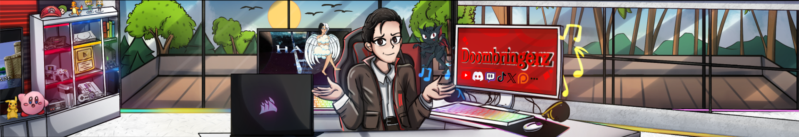

> **Yes I use AI. Tool, not author. The vision and the taste stay mine.**

Games, comics, cartoons, bots, SaaS. No funding, no team. Just the work.

Self-proclaimed Laziest YouTuber in the Gaming Universe. Low-energy most days. OH BOI mode when something clicks.

---

## Currently building

<table>
<tr>
<td colspan="2" align="center">

 
<b>The First Blink</b>, cosmological prologue in the Doombringerz Universe
</td>
</tr>
<tr>
<td width="50%" align="center">

 
<b>EclipseCP</b>, community + CMS platform, used in production
</td>
<td width="50%" align="center">

 
<b>HR Protocol</b>, Rascal &amp; Halcyon, 38-module Discord stack
</td>
</tr>
<tr>
<td width="50%" align="center">

 
<b>Laetium</b>, social analytics SaaS
</td>
<td width="50%" align="center">

 
<b>Relyo</b>, community membership platform
</td>
</tr>
</table>

The hub: **[doombringerz.com](https://doombringerz.com)**

## Featured

Pinned below: a mix of the dev tools I ship (`oh-boi-cli`, `win-rice-doombringerz`, `doombringerz-vault`) and tiles for the live products.

## Stack

**Languages**

**Backend**

**Frontend**

**Game engines**

**Data**

**Infra**

**Payments**

**AI / media**

---

---

© 2026 Doombringerz. All rights reserved. Brand assets (banner, logos, art) are not licensed for reuse.
